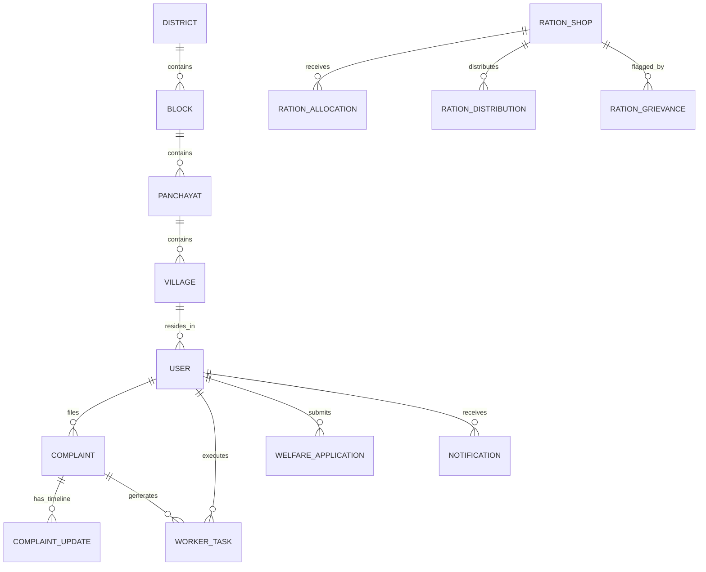

# Database Schema & Mongoose Models

Database: **MongoDB** with **Mongoose ODM**

## 1. Entity Relationship Diagram (Mermaid)

## 2. Key Collections & Indexes

1. **users**:
   - Unique Index: `phone`
   - Role Enum: `CITIZEN`, `PANCHAYAT_OFFICER`, `FIELD_WORKER`, `ADMIN`
   - References: `villageId`, `panchayatId`, `blockId`, `districtId`, `departmentId`

2. **complaints**:
   - Unique Index: `complaintId` (`GRV-YYYY-XXXX`)
   - 2dsphere Geospatial Index: `location.coordinates` `[lng, lat]`
   - Compound Indexes: `{ status: 1, category: 1, priority: 1, villageId: 1 }`, `{ createdAt: -1 }`
   - Status Enum: `SUBMITTED`, `UNDER_REVIEW`, `VERIFIED`, `REJECTED`, `REQUESTED_INFORMATION`, `ASSIGNED`, `IN_PROGRESS`, `RESOLVED`, `CLOSED`, `REOPENED`, `ESCALATED`

3. **complaintupdates**:
   - Index: `complaintId`
   - Stores actor name, role, previous status, new status, proof URLs, and notes.

4. **workertasks**:
   - Unique Index: `taskId` (`TSK-YYYY-XXXX`)
   - Indexes: `complaintId`, `workerId`
   - Status Enum: `ASSIGNED`, `ACCEPTED`, `REJECTED`, `IN_PROGRESS`, `COMPLETED`
   - Stores: `beforePhotos`, `afterPhotos`, `completionNotes`, `proofLocation`

5. **welfareschemes** & **welfareapplications**:
   - Unique Index: `code` (e.g. `PM-AWAS-GRAMIN`)
   - Unique Index: `applicationId` (`APP-YYYY-XXXX`)

6. **rationshops**, **rationallocations**, **rationdistributions**:
   - Masked card number representation (e.g., `UP-AAY-****-5829`)
   - Indexes: `shopId`, `citizenId`, `monthYear`
